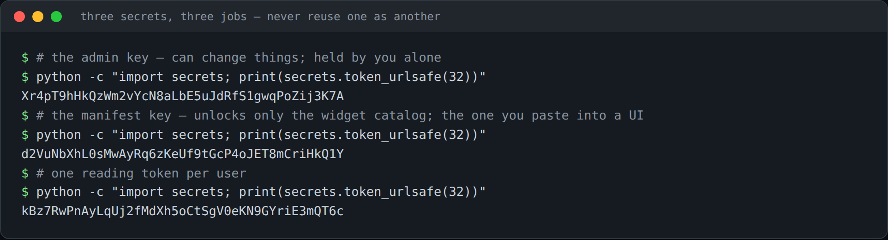
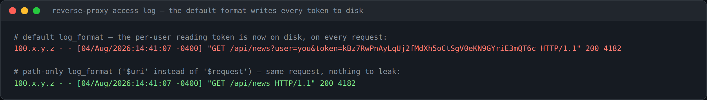

# Secrets and Access

Some backends behind BDOBB — the [[news-ticker|news ticker]] in particular — need care around how credentials are issued and where they travel. This page is the reference for that model.

## Why the news ticker's token travels in the URL

Every instinct says a credential shouldn't ride in a URL, and normally that instinct is right. It's correct here because of how the widget is embedded: it's an iframe, so no credential the dashboard holds comes along automatically; its live feed is a browser WebSocket, which cannot send a custom header; and a session cookie — the classic fix — is exactly the mechanism modern browsers block inside cross-site iframes. Once those options are ruled out by the embedding itself, the URL is what's left. It's a constraint, not a shortcut.

## Three separate secrets, one purpose each

The ticker deliberately uses three distinct keys instead of one:

- **Admin key** — can change server configuration. Held by you (or your admin) alone; never shared.
- **Manifest key** — unlocks only the widget catalog. This is the one value you paste into BDOBB or Workspace as the backend's API key (see [[backends-and-connections|Backends and Connections]]). Leaking it should confer nothing more than catalog access.
- **Per-user token** — grants read access to one user's feeds.

The server refuses to start if the admin key and manifest key are the same value — that reuse is treated as a configuration error, not a convenience.

## Generating the secrets

Each secret should be its own randomly generated value:

```bash
python -c "import secrets; print(secrets.token_urlsafe(32))"
```

Run this once per secret you need (`TICKER_ADMIN_KEY`, `TICKER_MANIFEST_KEY`, and one `TICKER_TOKEN_<USER>` per user).



## The mode with no tokens at all

If the backend sits behind Tailscale Serve, it can trust the caller's verified network identity instead of a token in the URL — see [[tailscale-networking|Tailscale Networking]]. In that mode, the widget catalog publishes clean, credential-free URLs: nothing to leak in a saved dashboard config, DevTools, or a log file.

## The one thing most likely to leak a token in practice

If your reverse proxy logs full request paths (including query strings) by default, every token-bearing URL gets written to disk on every request. Configure the proxy to log paths **without** query strings.



## Why the catalog is locked this tightly

A widget catalog is itself a disclosure: it lists what feeds a user is watching, and feed URLs routinely embed *other* services' API keys. Treat the catalog the way you'd treat any other access-controlled directory, not as harmless metadata.

---
*Source: Adventures in OpenBB, Ep. 8 — "All the News That Fits, We Print."*
*See also: [[news-ticker|News Ticker]] · [[rss-feed-sources|RSS Feed Sources]] · [[tailscale-networking|Tailscale Networking]] · [[troubleshooting-infrastructure|Configuring the Infrastructure]]*
