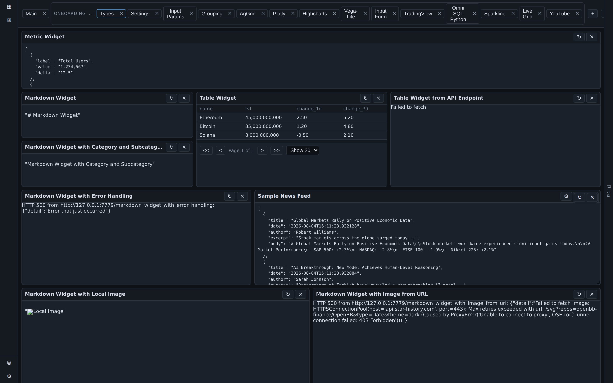
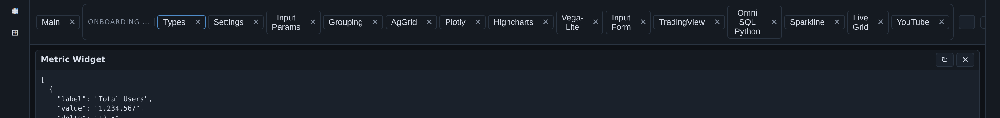
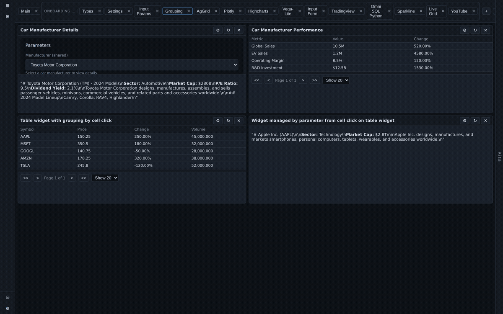
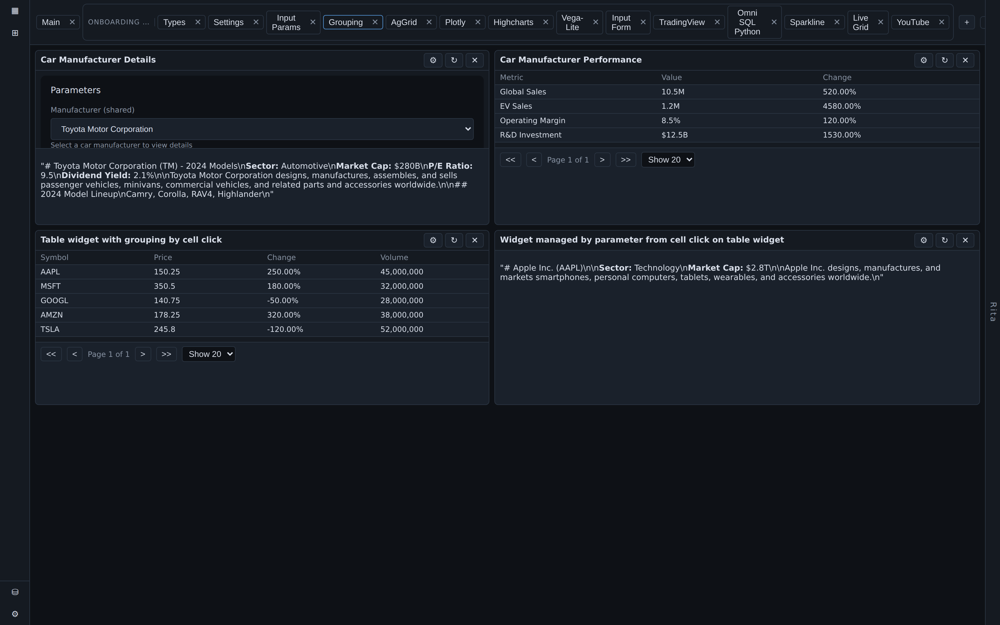
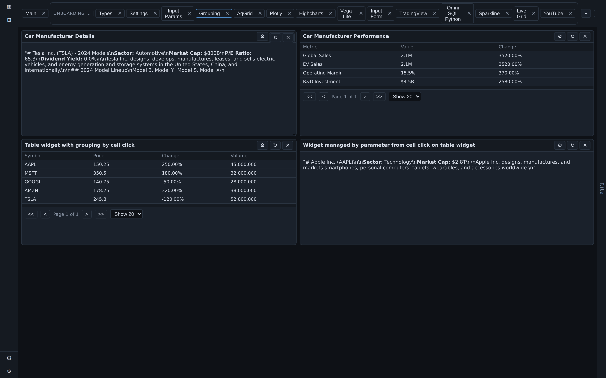
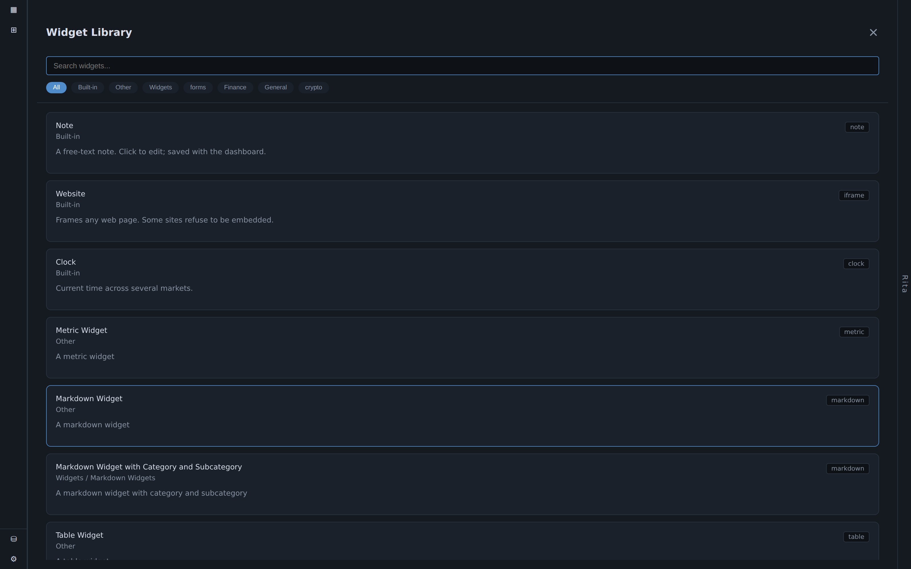
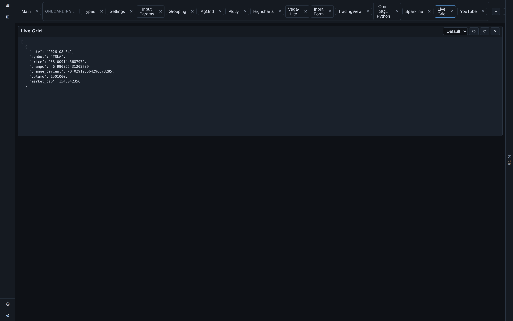
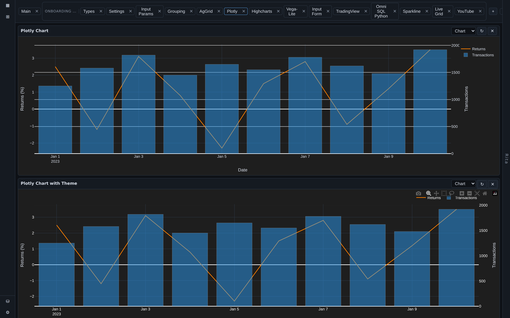

# Importing Dashboards

Once a backend is connected (see [[connecting-a-backend|Connecting a Backend]]), don't build dashboards widget by widget if the backend already ships prearranged ones — import them instead.

## Import an app definition

1. On the dashboard strip, choose **Import**.
2. Point it at the backend's `apps.json` — this is a complete app definition: a set of dashboards with widgets already arranged and configured.
3. The whole set unfolds at once as themed dashboard tabs.

OpenBB's reference backend, for example, ships fourteen themed dashboard tabs covering its full ~70-widget library.

## Parameter grouping

Some dashboards link cards together through **parameter grouping**: two or more widgets share a control, so changing it on one card updates every card in the group. Change the company on one widget and its partner follows instantly — this is what turns a pile of independent widgets into a single coherent instrument.

| Before | After |
|---|---|
|  |  |

## The widget library

Every widget a connected backend exposes appears in the library, browsable and searchable. See [[dashboards-and-widgets|Dashboards and Widgets]] for how to browse it, add individual widgets to a dashboard, and what to expect from different widget types (tables, interactive charts, metric tiles, markdown, PDFs, parameter forms).

## When a widget type isn't natively rendered

A small number of exotic widget types don't have a custom BDOBB renderer. Rather than failing, these render as neatly formatted raw data — you still see the values, just without the custom visual treatment. This is deliberate: an explicit, named fallback beats a blank card.

Interactive Plotly-style charts are natively supported:

---
*Source: Adventures in OpenBB, Ep. 5 — "Kick the Tires in Ten Minutes."*
