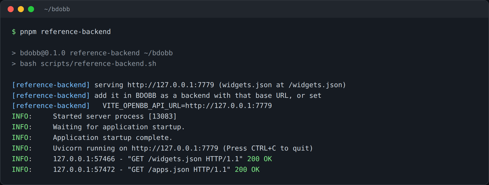

# Installing and Running BDOBB

BDOBB (Better Desktop for OpenBB) is a Tauri desktop app that speaks OpenBB's published widget and agent protocols against backends you point it at. This page gets a working copy on your machine with no account, no API keys, and no external server required.

## The fastest path: OpenBB's reference backend

You don't need your own data stack to try BDOBB. OpenBB publishes a reference backend — their own working example of an OpenBB-compatible backend, about seventy widgets across fourteen themed dashboards — and BDOBB can fetch and run it for you locally.

Prerequisites: Node with `pnpm`, Rust, and Python.

```bash
git clone --branch v5.0.0 --depth 1 https://github.com/artcashin/bdobb
cd bdobb
pnpm install
pnpm reference-backend
```

`pnpm reference-backend` fetches OpenBB's reference backend, sets up its environment, and starts serving it on `http://127.0.0.1:7779`. First run takes about twenty seconds; after that it starts instantly.



Leave that running, and in a second terminal, start the app itself:

```bash
pnpm dev          # the frontend dev server
pnpm tauri dev    # the desktop window
```

From here, go to [[connecting-a-backend|Connecting a Backend]] and point BDOBB at `http://127.0.0.1:7779`.

## Running against your own stack

If you already have an OpenBB-compatible backend (self-hosted OpenBB Platform, a custom widgets.json server, etc.), skip the reference backend and jump straight to [[connecting-a-backend|Connecting a Backend]] with your own backend's URL.

## What the reference backend does not cover

The reference backend serves *data* — tables, charts, metric tiles. It is not an AI agent, so it won't exercise BDOBB's chat pane. To try [[ai-chat|AI Chat]], you need an agent of your own — see [[rita-ai-agent-setup|Setting Up the Rita AI Agent]].

## Conformance testing (for backend developers)

If you're building your own OpenBB-compatible backend and want to check it against BDOBB, the repo ships a conformance suite that runs against the reference backend:

```bash
pnpm test:reference
```

This suite is deliberately strict: it fails loudly if the reference backend isn't running, rather than skipping gracefully — a test that can excuse itself reports green for a broken app.

---
*Source: Adventures in OpenBB, Ep. 5 — "Kick the Tires in Ten Minutes."*
