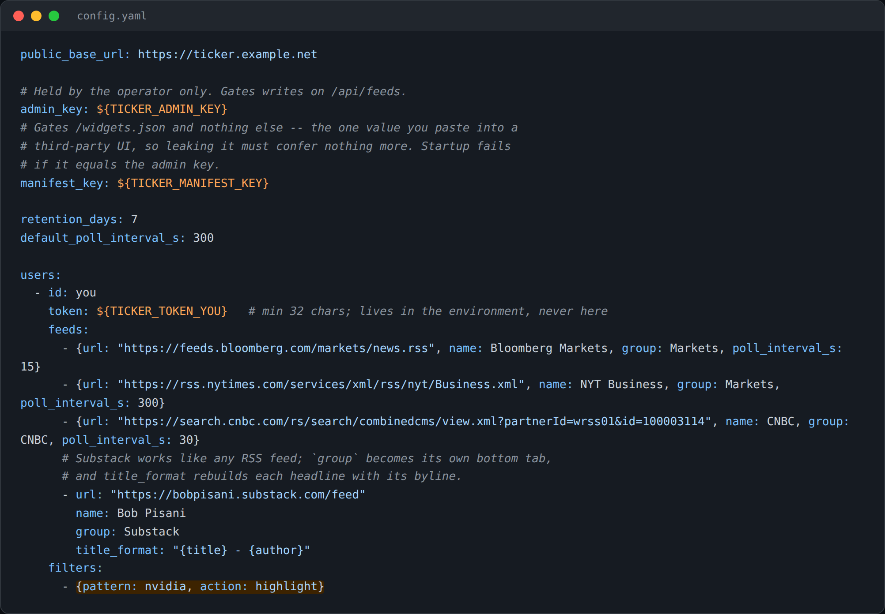

# RSS Feed Sources

This page covers running and configuring the **rss-ticker** service that powers the [[news-ticker|News Ticker]] widget.

## Setting up the service

1. Clone the release and copy the example config:
   ```bash
   git clone --branch v8.0.0 --depth 1 https://github.com/artcashin/rss-ticker
   cp config.example.yaml config.yaml
   ```
2. List your feeds in `config.yaml`. Each feed takes a `name`, an optional `group` (groups become the widget's tabs), and an optional `poll_interval_s`.
3. Generate the three secrets described in [[secrets-and-access|Secrets and Access]] and reference them from the config as `${VAR}` — the server refuses to start if any are missing, or if the admin and manifest keys match.
4. Set `public_base_url` to the URL your dashboard will actually reach the server at. It's baked into the widget catalog — if it's wrong, the widget renders as a blank frame.
5. `docker compose up -d`. TLS termination is your responsibility at a proxy in front — the service itself binds plaintext to loopback only, on purpose. Configure that proxy to log paths **without** query strings (see [[secrets-and-access|Secrets and Access]]).



## A starting feed set

The example config ships a working set to start from: Bloomberg Markets, WSJ, NYT Business, CNBC, and a Substack tab. Substack feeds are simply `https://<name>.substack.com/feed`.

## Byline formatting for Substack

Substack feeds carry the author separately from the title. Add a per-feed template so bylines show on the headline row:

```yaml
title_format: "{title} - {author}"
```

## Highlight and filter rules

Under `filters:` in the config:

```yaml
filters:
  - pattern: nvidia
    action: highlight
```

- `action: highlight` paints matching headlines in an accent color.
- `action: include` turns the ticker into a matched-only wire (only headlines matching a pattern are shown).

## Be a polite poller

Set `poll_interval_s` deliberately per feed rather than defaulting everything to a fast interval — a fast-moving wire deserves a faster look than a weekly letter, and neither deserves hammering. Some publishers throttle or disconnect clients that poll too aggressively.

## Connecting the widget

Once the service is running, add it as a backend using the **manifest key** as the API key (Workspace/BDOBB send it as `X-API-KEY`), then drop the News window or News rail widget on a dashboard — see [[news-ticker|News Ticker]].

## No-token mode

If you're running behind Tailscale Serve, you can skip URL-embedded tokens entirely — see [[tailscale-networking|Tailscale Networking]].

---
*Source: Adventures in OpenBB, Ep. 8 — "All the News That Fits, We Print."*
*See also: [[news-ticker|News Ticker]] · [[secrets-and-access|Secrets and Access]] · [[troubleshooting-infrastructure|Configuring the Infrastructure]]*
