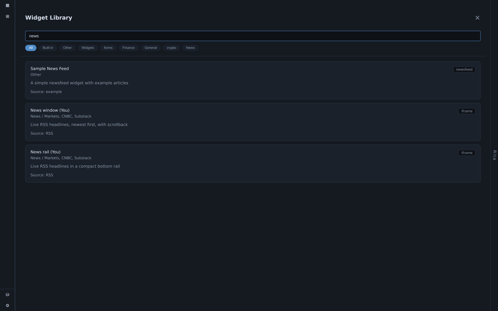
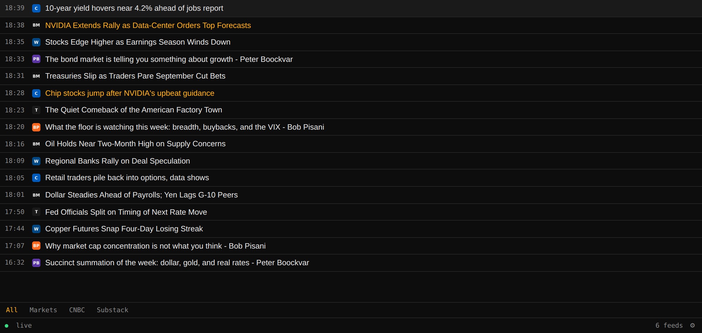
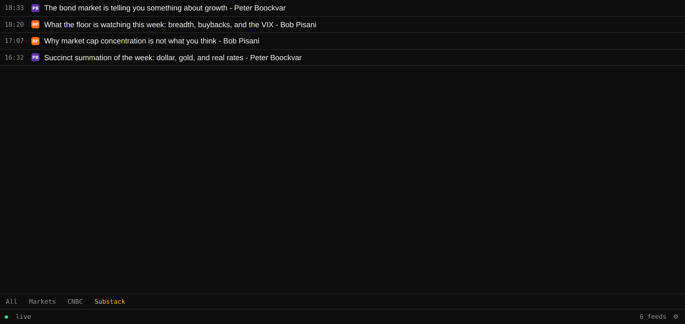
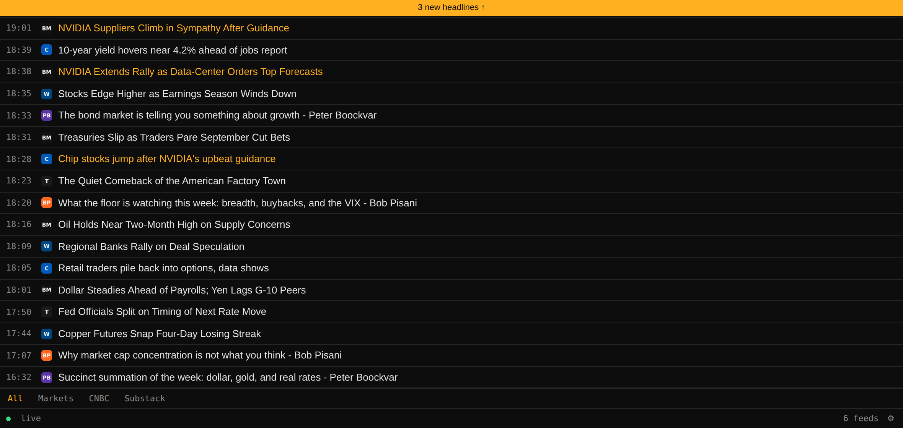
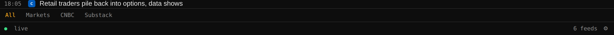
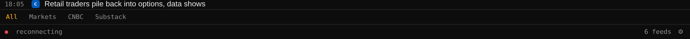

# News Ticker

The news ticker is a Bloomberg-style headline wire: newest article on top, favicon and timestamp on every row, headlines grouped into tabs. It's backed by a small companion service (**rss-ticker**) that polls RSS feeds — from wire services to Substack market commentary — and pushes new items to the widget over a live connection.

For how to run the rss-ticker service itself and configure its feeds, see [[rss-feed-sources|RSS Feed Sources]].

## Adding the ticker to a dashboard

1. Add the rss-ticker service as a backend (see [[connecting-a-backend|Connecting a Backend]]). Use the **manifest key** as the API key — see [[secrets-and-access|Secrets and Access]] for why this specific key and not another.
2. Open the widget picker and choose one of the two ticker widgets:
   - **News window** — the full-size widget, for a dedicated dashboard card.
   - **News rail** — a compact two-row strip, made to sit at the bottom of a dashboard like a broadcast ticker.

## Reading the ticker

- **Group tabs** run along the bottom — each is a feed group you defined in the ticker's config (e.g. Markets, CNBC, Substack).
- **Highlighted headlines** — any headline matching a keyword you configured is painted in an accent color (a highlight rule; see [[rss-feed-sources|RSS Feed Sources]]).
- **Substack bylines** — Substack feeds carry the author separately from the title; the ticker can be configured to show `{title} - {author}` so the byline is visible on the row.

- **New-headlines pill** — if headlines arrive while you're scrolled down reading, they slot in above without moving the row under your cursor, and a quiet *"N new headlines ↑"* pill appears.

- **Status dot** — distinguishes "the wire is quiet" (no recent articles, connection fine) from "the wire is dead" (connection lost). Worth knowing the difference at a glance.

| Wire is live/quiet | Wire is dead |
|---|---|
|  |  |

- **Opening a story** always opens a new browser tab — the ticker never navigates itself away from the wire.

## What the ticker deliberately doesn't do

The ticker holds none of your publisher subscription credentials. Headlines are the free, public layer; when you click through to a paywalled story, it's your own browser doing the reading, using whatever subscription login already lives there. This is a design choice, not a missing feature — no publisher login sits on a server anywhere waiting to leak.

## Native rail vs. embedded widget

BDOBB can show the ticker two ways: as an embedded page (a website-card widget, added like any other backend widget — see [[layout-and-navigation|Layout and Navigation]]), or as a native rail drawn in BDOBB's own type and theme with no surrounding frame. If the ticker isn't rendering data inside an embedded card, check whether your BDOBB build ships the native rail integration for your version.

---
*Source: Adventures in OpenBB, Ep. 8 — "All the News That Fits, We Print."*
*See also: [[rss-feed-sources|RSS Feed Sources]] · [[secrets-and-access|Secrets and Access]] · [[tailscale-networking|Tailscale Networking]] · [[troubleshooting-using-bdobb|Using BDOBB]] · [[troubleshooting-infrastructure|Configuring the Infrastructure]]*
