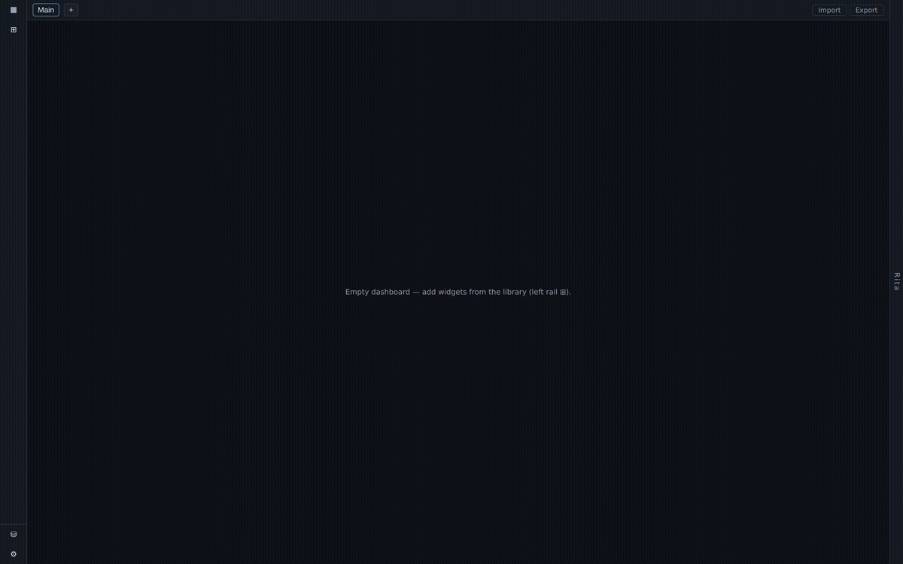
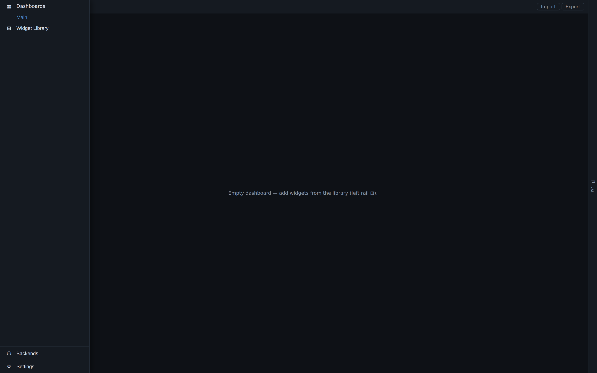
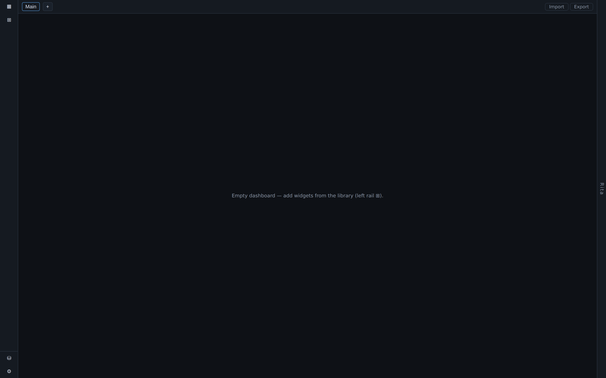
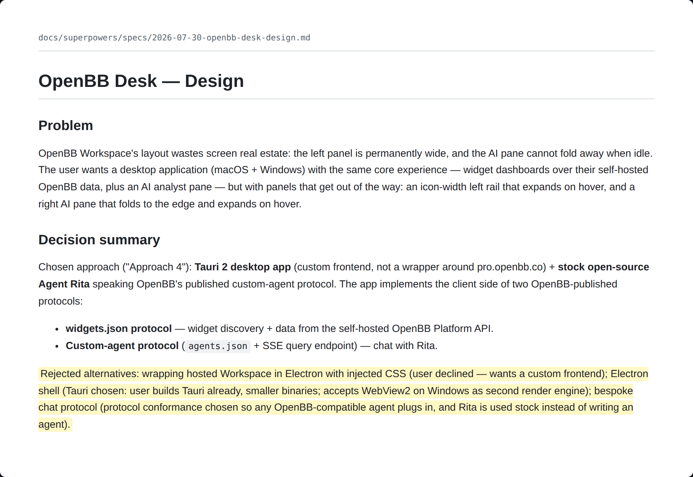

# Layout and Navigation

BDOBB's layout is built around one rule: chrome should never compete with the market for screen space. Every panel that isn't actively in use gets out of the way.

## The left rail

The left navigation rail rests at icon width — a slim column of symbols — by default. Move your cursor over it and it glides open, **floating over the dashboard** rather than pushing it aside. Move away and it folds back. Because it overlays instead of reflowing the grid, your charts never twitch or resize while you navigate.

| Rail open | Rail closed |
|---|---|
|  |  |

## The AI pane

The chat pane lives on the right edge and folds to a thin strip the same way the rail does — open on hover/interaction, folded when idle.

**While the AI is answering, the pane does not stay pinned open.** If you move on to other work mid-answer, the pane folds away and a small unread dot appears on the folded edge once the reply is ready. The reasoning: you asked the question so you could keep working, not so you'd be forced to watch it type. Reopen the pane whenever you're ready to read the answer — nothing is lost by folding it.

## Degraded states

BDOBB is built to fail in pieces, never as a whole:

- **A backend goes offline** — only the widgets and dashboards that depend on it show a retry state. Everything backed by a working connection keeps running.
- **The AI agent is unreachable** — the chat pane names the problem directly. The rest of the dashboard is unaffected; data widgets don't care whether the agent is up.
- **A widget receives malformed or unexpected data** — you get a raw view of what actually arrived (see [[importing-dashboards|Importing Dashboards]]), never a blank card.

No single failure blanks the whole app.

## Why the layout works this way

This layout wasn't the first idea — it came out of a structured design pass that weighed four different approaches (wrapping the hosted OpenBB interface, a from-scratch Electron app, a from-scratch Tauri app, and a bespoke chat protocol) before settling on the icon-rail-plus-fold-pane design described above, built on OpenBB's own published protocols rather than anything proprietary.

## Website-card widgets

Some widget types are simply embedded pages — a backend-served HTML document shown inside a card, the same mechanism a browser iframe uses. This is how website-card widgets are rendered without needing a bespoke integration: if a backend can serve a page, BDOBB can embed it.

---
*Source: Adventures in OpenBB, Ep. 3 — "I Asked for Electron and Got Talked Out of It."*
