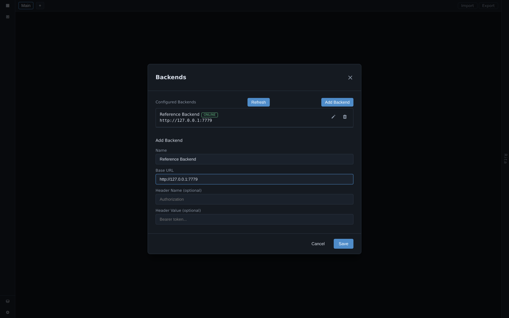
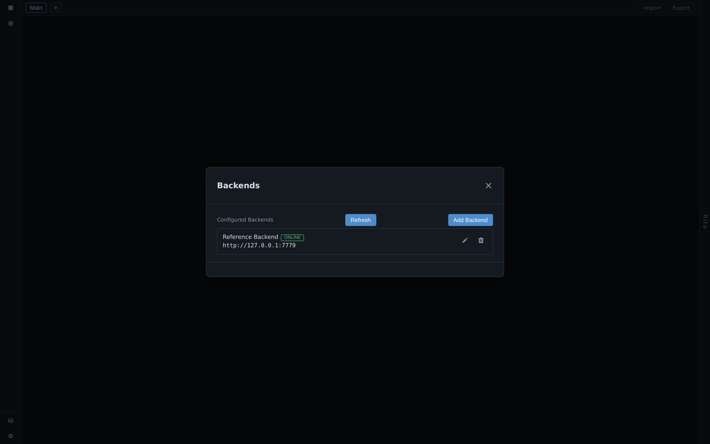

# Connecting a Backend

BDOBB doesn't ship with data — it's a client for backends that speak OpenBB's published widgets.json protocol. You add one or more backends by URL, and their widgets, dashboards, and (if present) agents become available in the app.

## Add a backend

1. Open the backend/connections panel and choose **Add backend**.
2. Enter the backend's base URL — for example `http://127.0.0.1:7779` if you're running OpenBB's reference backend (see [[installing-and-running|Installing and Running BDOBB]]).
3. If the backend requires an API key, enter it here. Different backends use this key differently — see [[backends-and-connections|Backends and Connections]] for how specific backend types (like the news ticker) use this field.
4. Save. The backend should report **online**, and its widgets populate the library.

## You can connect more than one backend

BDOBB is designed around multiple simultaneous backends — a general OpenBB Platform backend, a [[news-ticker|news ticker]], and an [[ai-chat|AI agent]] can all be connected at once, each contributing its own widgets and dashboards to the same app.

## Once connected

With a backend online, its widgets appear in the library (see [[dashboards-and-widgets|Dashboards and Widgets]]) and, if it ships one, its `apps.json` dashboard set becomes importable (see [[importing-dashboards|Importing Dashboards]]).

## If a backend goes offline

BDOBB degrades per-service, not all at once. If one backend becomes unreachable, only the widgets and dashboards that depend on it show a retry state — everything else keeps working. See [[layout-and-navigation|Layout and Navigation]] for how degraded states are shown in the interface.

---
*Source: Adventures in OpenBB, Ep. 5 — "Kick the Tires in Ten Minutes"; Ep. 3 — "I Asked for Electron and Got Talked Out of It."*
