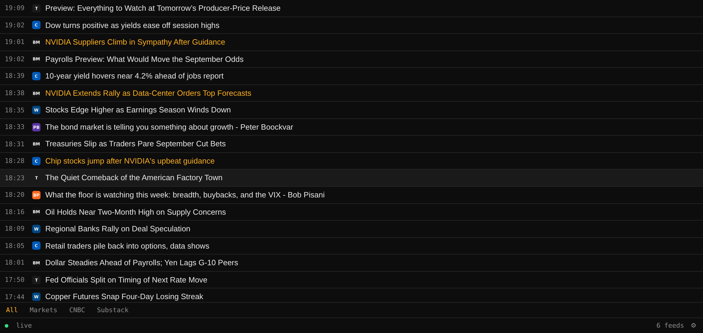

# Troubleshooting: Configuring the Infrastructure

Symptom-first index of issues in the backend services BDOBB connects to — openbb-docker, rss-ticker, Rita/MCP, and Tailscale networking. These are all fixed server-side, not inside the BDOBB app. For app-side issues (iPad builds, settings, install), see [[troubleshooting-using-bdobb|Using BDOBB]].

## AI Chat / Rita Backend

**Chat errors on every single request the moment you connect the tool server.**
Not degraded — dead, with a context-size error. The full OpenBB tool catalogue (200+ tools) is roughly 150k tokens of descriptions, which exceeds most local models' request-size limit; an oversized request is rejected outright, never trimmed. Launch the MCP server with `--default-categories equity --tool-discovery` and confirm the fix by checking that `tools/list` now returns a handful of discovery tools instead of the full flood. Rule of thumb: ~700 tokens per advertised tool, against your model's real per-request slot (context size ÷ parallel slots). See [[rita-ai-agent-setup|Setting Up the Rita AI Agent]].

**Rita won't use your local model, or silently tries to reach the internet.**
As shipped, Rita's provider list only knows cloud endpoints. Use the OpenAI-compatible provider with `OPENAI_BASE_URL` pointed at your model server. Two sub-traps: the API key must exist in the model server's key file *and* the server must be restarted afterward (keys are read at startup); a wrong base URL can produce confusing auth errors rather than a clean "connection refused." See [[rita-ai-agent-setup|Setting Up the Rita AI Agent]].

**MCP discovery fails against a server you can `curl` just fine.**
Check the path exactly: it's `/mcp`, not `/mcp/`. The server answers the trailing-slash form with a redirect, and not every client follows redirects.

**Queries return HTTP 400 naming an unfamiliar field.**
The agent protocol distinguishes `null` from *absent* — several optional fields are rejected when sent as `null` and must be omitted entirely instead. Don't trust documentation on this; verify against the live server and read the error body, which names the offending field.

**One misconfigured tool server hangs every chat turn, forever.**
A server that accepts a connection and never replies is worse than a dead one. Every tool-server call needs a hard timeout (about ten seconds is reasonable) with a visible failure state — "this server is down, skipping it" — rather than a silent hang.

See [[rita-ai-agent-setup|Setting Up the Rita AI Agent]] and [[ai-chat|AI Chat]] for full context.

## News Ticker Service

**A forged request to the node's private address returns real data, even though the service is "bound to loopback."**
This is the Tailscale userspace-networking trap: the container's default networking mode makes the loopback bind meaningless from outside the app's view. Set `TS_USERSPACE=false` on the sidecar (kernel networking) and re-verify with the same forged-header probe. See [[tailscale-networking|Tailscale Networking]] — this affects every sidecar'd service, not just the ticker.

**Old articles reappear as "new" on a schedule.**
If deduplication is based on "does this row exist," and old rows get deleted by a retention policy, a still-published old article gets re-inserted (and re-broadcast as new) the next time it's polled. This is a server-side fix (dedup should track when an article was last *seen*, not just whether a row exists) — if you're seeing this on a self-hosted instance, check your retention/dedup logic.

**The widget shows "live" but nothing is actually arriving.**
Possible causes: a slow client whose send queue silently overflowed, or a connection that dropped without the widget being told to reconnect. On the app side, check the [[news-ticker|status dot]] first; if it's stuck "dead" after a reload, this is the server-side bug to chase down.

**A future-dated headline sits pinned at the top and gap-fills stop working after a disconnect.**
Some feeds publish future-dated items. If the server's gap-fill logic isn't clamping its sort timestamp to "now," a future article can make every subsequent "give me everything I missed" query return nothing. Server-side fix; if self-hosting, ensure sort timestamps are clamped at ingest.

**A tab that should show a headline doesn't, in a real browser, despite passing tests.**
Real browsers report tag names in uppercase; a test environment that models them lowercase can pass while the real feature is broken. Not something you can fix from the widget side — flag it if you're maintaining the service yourself.

See [[news-ticker|News Ticker]], [[rss-feed-sources|RSS Feed Sources]], and [[tailscale-networking|Tailscale Networking]] for full context.

---
*Sources: Adventures in OpenBB, Episodes 6–9 "Gotchas" sections.*
